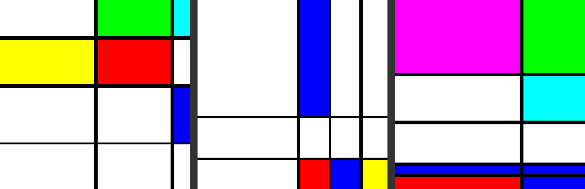

# piet-mondrian-generator

A python script that generates images similar to the works of [Piet Mondrian](https://en.wikipedia.org/wiki/Piet_Mondrian) using Python Pillows and Numpy. Below is three examples of the program in use.

Using Pillows, a transparent image is created and several straight lines then populate the image forming an empty grid of irregular sized cells. A function finds transparent pixels and fills the corresponding cell using an experimental flood fill feature in Pillows. This flood fill is **very** slow hence the slow execution time of the script. Once there is no more transparency in the image all cells are filled and the image is saved. 

## Dependencies

* [Pillows](https://github.com/python-pillow/Pillow)
* [Numpy](https://github.com/numpy/numpy) (1.7.0 or later)
* random.py